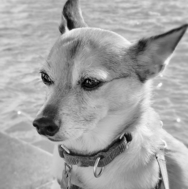
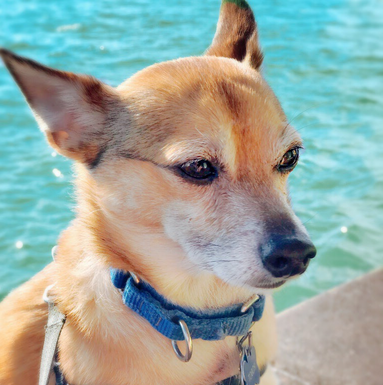
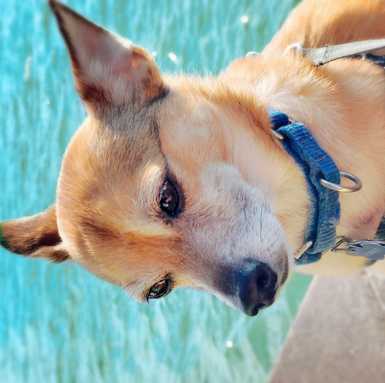
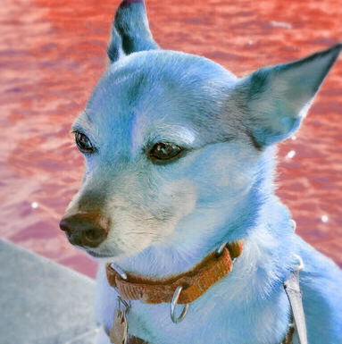
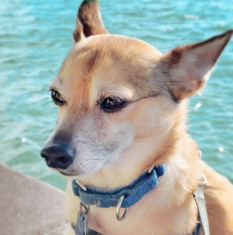
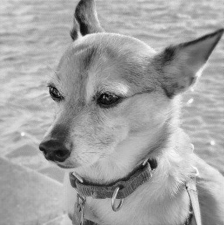
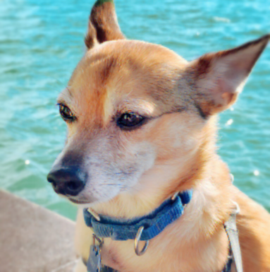
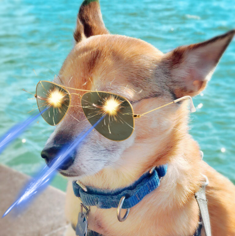

# Computer Graphics – Raster Images

> **To get started:** Clone this repository:
>
>     git clone git@github.com:panuelosj/computer-graphics-csc317-A1-Raster_Images.git
>
> **Do not fork:** Clicking "Fork" will create a _public_ repository. If you'd
> like to use GitHub while you work on your assignment, then mirror this repo as
> a new _private_ repository:
> https://stackoverflow.com/questions/10065526/github-how-to-make-a-fork-of-public-repository-private

## Introduction

Welcome to Computer Graphics! The main purpose of this assignment is to get you
up and running with the Python tooling used throughout the course and to
introduce digital image representation and manipulation.

## Learning objectives

By completing this assignment you will be able to:

* represent raster images as `numpy` arrays and reason about their memory
  layout (rows, columns, channels; `uint8` in `[0,255]` vs. floats in `[0,1]`);
* convert colour images to perceptual grayscale and justify the channel weights;
* explain how digital cameras capture colour through a **Bayer mosaic** and
  reconstruct full colour by **demosaicing** (interpolation);
* convert between the **RGB** and **HSV** colour spaces and use HSV to build
  hue-shift and desaturation filters;
* composite semi-transparent images with the **Porter-Duff "over"** operator;
* write images to a simple file format (`.ppm`) by hand.

## Prerequisite knowledge

* **Math**: averages and linear interpolation; modular arithmetic (hue wraps
  at 360°). No linear algebra needed yet.
* **Programming**: Python functions and control flow; `numpy` array creation,
  indexing, slicing and dtypes. If `rgb[0::2, 1::2, 2]` reads as gibberish,
  skim a numpy indexing tutorial first — vectorized thinking pays off all term.
* **Course**: none — this is the first assignment and doubles as your
  environment check.

### Prerequisite installation and setup

This assignment ships with everything it needs. From the **root of this
repository**, create its virtual environment once:

```bash
./init.sh            # macOS / Linux
# or, on Windows (PowerShell):
.\init.ps1
```

That creates `./venv` here and installs the dependencies (`numpy`, `pillow`,
`scipy`, `polyscope`). Then activate it in every new shell:

```bash
source venv/bin/activate           # macOS / Linux
# .\venv\Scripts\Activate.ps1      # Windows
```

On Windows, PowerShell may refuse to run `init.ps1` or `Activate.ps1` under
its default execution policy. If so, allow scripts for the current session
only and try again:

```powershell
Set-ExecutionPolicy -Scope Process -ExecutionPolicy Bypass
```

Each assignment has its own `venv`, so activate the one belonging to the
assignment you are working on.

### Layout

All assignments share a similar directory layout:

    README.md            this file: background, tasks, and grading
    init.sh / init.ps1   one-time setup: creates ./venv and installs deps
    main.py              the main script that runs your code end-to-end
    run_tests.py         runs the unit checks and reports how many pass
    check_my_work.py     the same checks, but weighted by each function's allocated marks
    export_expected.py   exports the public tests' inputs and expected outputs as readable text and images
    cgcommon/            code shared by every assignment (do not edit)
    src/                 one file per function that YOU implement
    tests/               the unit checks and their reference results (do not edit)
    tests/expected/      the public test data, readable (INDEX.md, .txt, .png)
    docs/images/         the sample results shown in this README
    data/                sample input data

The `src/` directory contains *empty implementations* (stubs) of the functions
you must write. **This is the only directory you edit.** Each file documents the
function's inputs, outputs, and the algorithm. Do **not** change `tests/`.

### Running the demo

```bash
python main.py                 # process the sample images in data/
python main.py data/dog.png    # process a specific image
```

Results are written to `out/` as both `.ppm` files (the simple format described
below) and `.png` previews you can open in any image viewer.

### Checking your work

This repo ships with two tools that could potentially be useful for working on 
this assignment: `run_tests.py` and `check_my_work.py`.

```bash
python run_tests.py                  # PASS/FAIL table + "Validated X/12"
python run_tests.py --only demosaic   # focus on a single function
python check_my_work.py              # scores your implementation
```

`run_tests.py` tells you *what* is broken. `check_my_work.py` runs the same
checks but reports them as marks per function, so you can see where you stand
before submitting. Keep going until you see `Validated 12/12`. Note that the 
function only marks it against the public unit tests, we will also validate 
against internal examples that are not released in this repo. 

When a check fails and the message alone is not enough, look at the data it
used: [`tests/expected/`](tests/expected/INDEX.md) holds every input and
expected output the public tests compare against, written out as readable text
(and as `.png` images where the array is a picture).
You can also load the fixture directly:

```python
import numpy as np
g = np.load("tests/golden/a1_golden.npz")
print(g.files)        # every array the tests use
g["<name>"]           # one of them
```

When a check that compares **images** fails, it also writes a visual
comparison next to your work:

```
out/test_diffs/<function>.got.png        what your code produced
out/test_diffs/<function>.expected.png   what was expected
out/test_diffs/<function>.diff.png       where they differ (brighter = worse)
```

and the failure message names how many pixels differ, by how much, and the
first one that does. This is usually enough to recognise the bug on sight (a whole
image slightly off is a coefficient; a few edge pixels is a boundary case; a
mirrored image is an index order).

## Sample results

These are produced by `python main.py` once your `src/` is complete.

**The individual filters**, each from one of your functions:

| original | `rgb_to_gray` | `reflect` | `rotate` |
|:---:|:---:|:---:|:---:|
|  |  |  |  |

| `hue_shift` (180°) | `desaturate` (0.25) | `simulate_bayer_mosaic` | `demosaic` |
|:---:|:---:|:---:|:---:|
|  |  |  |  |

**The composite** — the whole pipeline in one picture: three RGBA
images alpha-composited over the photo with your `over`.



## Background

> Every assignment will start with a **Background** section. This cites a
> chapter of the book to read or review the math and algorithms behind the
> task. Students following the lectures should already be familiar with this
> material.

### Read Chapter 3 of _Fundamentals of Computer Graphics (4th Edition)_.

The most common digital representation of a color image is a 2D array of
red/green/blue intensities at pixels. Since each entry in the array is actually
a 3-vector of color values, we can interpret an image as a 3-tensor or 3D array.
In this Python course we represent an image as a `numpy` array with shape
`(height, width, channels)` — for example an RGB image is `(H, W, 3)` and a
grayscale image is `(H, W)`. Integer pixel intensities use `uint8` in the range
`[0, 255]`; for numerically sensitive computations (e.g. converting between RGB
and HSV) it is convenient to work with floating-point values where `0` maps to
`0.0` and `255` maps to `1.0`.

> Q: Suppose you have a 767 × 772 RGB image stored in an array called `data`.
> How would you access the green value at the pixel on the 36th row and 89th
> column?
>
> A: `data[35, 88, 1]` (Remember Python starts counting at `0`.)

### Alpha map

Natural images (e.g. photographs) only require color information, but to
manipulate images it is often useful to also store a value representing how much
of a pixel is "covered" by the given color. Intuitively this value (called alpha
or α) represents how opaque (the opposite of _transparent_) each pixel is. We
store an RGB + α image as a _4_-channel RGBA image, i.e. an `(H, W, 4)` array.

`.png` files can store RGBA images, whereas our simpler `.ppm` file format only
stores grayscale or RGB images.

### .ppm files

We'll use a very basic _uncompressed_ image file format to write out the results
of our tasks: the
[.ppm](https://en.wikipedia.org/wiki/Netpbm_format#File_format_description).

Like many image file formats, `.ppm` uses 8 bits per color value. Color
intensities are represented as an integer between `0` (0% intensity) and `255`
(100% intensity). To simplify the implementation and to help with debugging, we
use the text-based `.ppm` formats for this assignment. A small RGB image looks
like:

    P3
    <width> <height>
    255
    r g b  r g b  ...

(`P2` is used for single-channel grayscale images.)

## Grayscale Images

Surprisingly there are
[many](https://en.wikipedia.org/wiki/Grayscale#Converting_color_to_grayscale)
acceptable and reasonable ways to convert a color image into a
[grayscale](https://en.wikipedia.org/wiki/Grayscale) ("black and white") image.
The complexity of each method scales with the amount that method accommodates
for human perception. For example, a very naive method is to average red, green
and blue intensities. A slightly better (and very popular) method is to take a
weighted average giving higher priority to green:

    gray = 0.2126 * R + 0.7152 * G + 0.0722 * B

> Q: Why are humans more sensitive to green?
>
> Hint: 🐒

## Mosaic images

The raw color measurements made by modern digital cameras are typically stored
with a single color channel per pixel. This information is stored as a seemingly
1-channel image, but with an understood convention for interpreting each pixel
as the red, green or blue intensity value given some pattern. The most common is
the [Bayer pattern](https://en.wikipedia.org/wiki/Bayer_filter). In this
assignment, we'll follow the **GBRG** pattern and assume the top-left pixel is
green, its right neighbor is blue and the neighbor below is red, and its
[kitty-corner](https://en.wiktionary.org/wiki/kitty-corner#Adverb) neighbor is
also green.

> Q: Why are more sensors devoted to green?
>
> Hint: 🐒

To _demosaic_ an image, we would like to create a full RGB image without
downsampling the image resolution. So for each pixel, we'll use the exact color
sample when it's available and average available neighbors (in all 8 directions)
to fill in missing colors. This simple [linear
interpolation-based](https://www.ics.uci.edu/~majumder/PHOTO/DemosaicingAndWhiteBalancing.pdf)
method has some blurring artifacts and can be improved with more complex
methods. _Just do "something reasonable" for pixels on the very boundary of the
image._

## Color representation

RGB is just one way to represent a color. Another useful representation stores
the [hue, saturation, and value](https://en.wikipedia.org/wiki/HSL_and_HSV) of a
color. This "HSV" representation also has 3 channels: the
[hue](https://en.wikipedia.org/wiki/Hue) `h` channel is stored in degrees (i.e.
on a periodic scale) in the range `[0, 360)` and the
[saturation](https://en.wikipedia.org/wiki/Colorfulness) `s` and
[value](https://en.wikipedia.org/wiki/Lightness) `v` are given as absolute
values in `[0, 1]`.

[Converting between RGB and
HSV](https://en.wikipedia.org/wiki/HSL_and_HSV#Converting_to_RGB) is
straightforward and makes it easy to implement certain image changes such as
shifting the hue of an image (e.g. Instagram's "warmth" filter) and the
saturation of an image (e.g. Instagram's "saturation" filter).

## Tasks

> Every assignment, including this one, will contain a **Tasks** section. This will
> enumerate all of the tasks a student will need to complete for this assignment.

> Implementations of nearly any task you're asked to implemented in this course can be found 
> online. AI can also now fairly reliably accomplish these tasts. Do not copy these and avoid 
> googling for code or using AI; instead, search the internet for explanations. Many topics 
> have relevant wikipedia articles. Use these as references. Always remember to cite any 
> references in your comments.

Implement each function in `src/`. Every file has a stub raising
`NotImplementedError`; replace it with your implementation. The unit checks in
`run_tests.py` validate each one.

| File | Marks | What it does |
| ---- | ----: | ------------ |
| `src/rgba_to_rgb.py` | 10 | Drop the alpha channel of an RGBA image. |
| `src/write_ppm.py` | 10 | Write a grayscale (`P2`) or RGB (`P3`) text `.ppm` file. |
| `src/reflect.py` | 10 | Mirror an image horizontally. |
| `src/rotate.py` | 10 | Rotate an image 90° counter-clockwise. |
| `src/rgb_to_gray.py` | 10 | Perceptual weighted-average grayscale. |
| `src/rgb_to_hsv.py` | 10 | Convert RGB → HSV (vectorized). |
| `src/hsv_to_rgb.py` | 10 | Convert HSV → RGB (vectorized). |
| `src/hue_shift.py` | 10 | Rotate every pixel's hue by a given number of degrees. |
| `src/desaturate.py` | 5 | Reduce saturation toward gray by a given factor. |
| `src/simulate_bayer_mosaic.py` | 5 | Build a single-channel GBRG mosaic. |
| `src/demosaic.py` | 5 | Reconstruct RGB from a Bayer mosaic by interpolation. |
| `src/over.py` | 5 | Porter-Duff "over" alpha compositing. |

**Total: 100 marks.**

> Tip: `rgb_to_hsv` and `hsv_to_rgb` are used by `hue_shift` and `desaturate`,
> so get those working first.

## Grading

Your `src/*.py` files are graded by the same unit checks you run locally, mapped
to the marks above, as well as additional internal examples. Submit only your 
`src/` directory (all the `.py` files inside the folder). Do not modify `tests/`.

### How your mark is computed

Each function's marks are split between two sets of tests:

| | share | what it is |
|---|---:|---|
| **public** | 30% | the tests in `tests/` that ship with this assignment — the ones `run_tests.py` and `check_my_work.py` run, whose inputs and expected outputs you can read in `tests/expected/` |
| **private** | 70% | the *same* checks run against a different set of inputs |

Both tests are run in the same way, just with different data. Note that the public
test data should be sufficient to fully test your code, the private tests are just
to avoid code that simply reproduces the published numbers but does not actually 
implement the functions asked.

### Submission

Submit your completed homework on MarkUs. Open the [MarkUs](https://markus.teach.cs.toronto.edu/markus) course
page and submit all the `.py` files in your `src/` directory under
Assignment 1: Raster Images.

### Questions?

Direct your questions to the [Issues page of this
repository](https://github.com/panuelosj/computer-graphics-csc317-A1-Raster_Images/issues).

### Answers?

Help your fellow students by answering questions or positions helpful tips on
[Issues page of this
repository](https://github.com/panuelosj/computer-graphics-csc317-A1-Raster_Images/issues).


